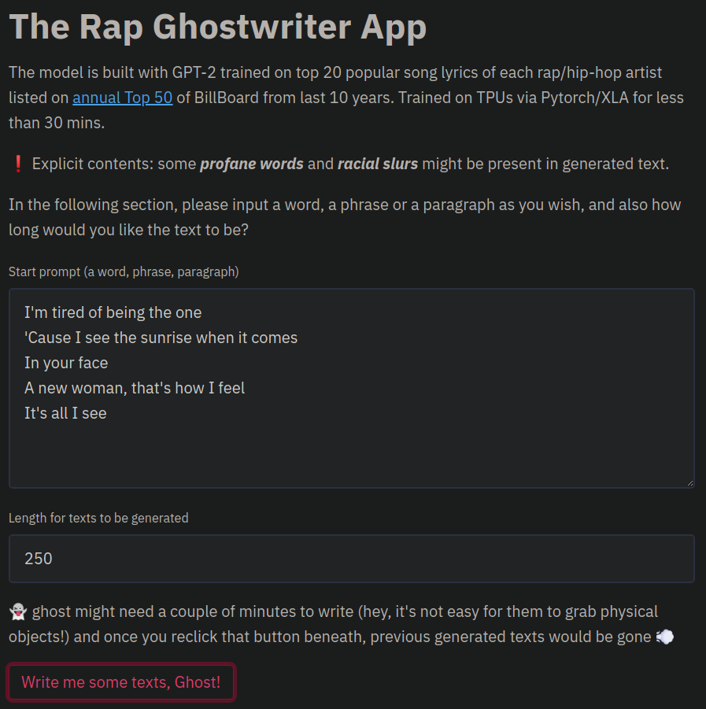

# rap-ghostwriter 

_[Streamlit](https://www.streamlit.io/) demo of the [rap-ghostwriter](https://github.com/yiting-tsai/rap-ghostwriter-app) model_

:package: The web app was built in Python using the following libraries:
- streamlit
- pytorch
- transformers (HuggingFace)
